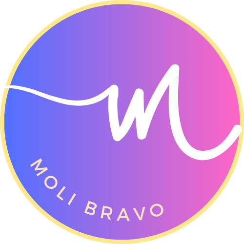

<a name="readme-top"></a>

<div aling="center">

  
  <br/>

  <h3><b>Portfolio setup and mobile first</b></h3>

</div>

# 📗 Table of Contents

- [📖 About the Project](#about-project)
  - [🛠 Built With](#built-with)
    - [Tech Stack](#tech-stack)
    - [Key Features](#key-features)
  - [🚀 Live Demo](#live-demo)
- [💻 Getting Started](#getting-started)
  - [Setup](#setup)
  - [Prerequisites](#prerequisites)
  - [Install](#install)
  - [Usage](#usage)
  - [Run tests](#run-tests)
  - [Deployment](#deployment)
- [👥 Authors](#authors)
- [🔭 Future Features](#future-features)
- [🤝 Contributing](#contributing)
- [⭐️ Show your support](#support)
- [🙏 Acknowledgements](#acknowledgements)
- [❓ FAQ (OPTIONAL)](#faq)
- [📝 License](#license)

# 📖 [Portfolio setup and mobile first] <a name="about-project"></a>

**[Portfolio setup and mobile first]** is my second project in Microverse.

## 🛠 Built With <a name="built-with"></a>

### Tech Stack <a name="tech-stack"></a>

<details>
  <summary>CSS</summary>
  <ul>
    <li><a href="https://developer.mozilla.org/en-US/docs/Learn/Getting_started_with_the_web/CSS_basics">CSS</a></li>
  </ul>
</details>

<details>
  <summary>HTML</summary>
  <ul>
  <li><a href="https://developer.mozilla.org/es/docs/Web/HTML">HTML</a></li>
  </ul>
</details>

<details>
  <summary>FIGMA</summary>
  <ul>
  <li><a href="https://www.figma.com/">FIGMA</a></li>
  </ul>
</details>

<p aling="right">(<a href="#readme-top">back to top</a>)</p>

## 🚀 Live Demo <a name="live-demo"></a>

COMING SOON!

<p aling="right">(<a href="#readme-top">back to top</a>)</p>

## 💻 Getting Started <a name="getting-started"></a>

To get a local copy up and running, follow these steps.

### Prerequisites

In order to run this project you need:

### Setup

Clone this repository to your desired folder:

> https://github.com/MoliBravo/Portfolio_setup_and_mobile_first/tree/Portfolio_Setup

### Install

Install this project with:
 ```
 cd Portfolio_setup_and_mobile_first/tree/Portfolio_Setup
 npm install
```
### Usage

> Please open any code editor of your choice and install live server extension to view project.

### Run tests

> npx hint .

### Deployment

You can deploy the project with the help of online web platform to host your website for free like gh-pages, netlify.

<p aling="right">(<a href="#readme-top">back to top</a>)</p>

## 👥 Authors <a name="authors"></a>

👤 **Mishelle Olivares**

- GitHub: [@githubhandle](https://github.com/MoliBravo)
- Twitter: [@twitterhandle](https://twitter.com/mishyolivares)
- LinkedIn: [LinkedIn](https://www.linkedin.com/in/mishelle-daniela-olivares-bravo-5b89b157/)

<p aling="right">(<a href="#readme-top">back to top</a>)</p>

## 🔭 Future Features <a name="future-features"></a>

- [ ] **[More information will be added very soon]**

<p aling="right">(<a href="#readme-top">back to top</a>)</p>

## 🤝 Contributing <a name="contributing"></a>

Contributions, issues, and feature requests are welcome!

Feel free to check the [issues page](../../issues/).

<p aling="right">(<a href="#readme-top">back to top</a>)</p>

## ⭐️ Show your support <a name="support"></a>

If you like this project please let me know

<p aling="right">(<a href="#readme-top">back to top</a>)</p>

## 🙏 Acknowledgments <a name="acknowledgements"></a>

I would like to thank to all my partners who are supporting me trough this week.

<p aling="right">(<a href="#readme-top">back to top</a>)</p>

## 📝 License <a name="license"></a>

This project is [MIT](./LICENSE) licensed.

<p aling="right">(<a href="#readme-top">back to top</a>)</p>